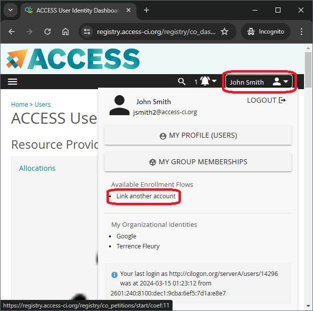

# ACCESS CI New User Account Setup

Welcome new ACCESS CI user! You should have received your ACCESS ID (a.k.a.,
username) from your local system administrator. However, there are several
steps you need to take before you can use your account.

## Read and accept the ACCESS CI Acceptable Use Policy (AUP)
Visit <https://access-ci.org/acceptable-use/> and read the ACCESS CI
Acceptable Use Policy (AUP). You must agree to this policy in order to use
ACCESS CI resources. If you do not agree to the AUP, please inform your
local system administrator so they can delete your account.

 
## Set/reset your ACCESS CI password
Visit <https://identity.access-ci.org/password-reset> and enter your ACCESS
ID. Then click the “SEARCH” button.

An email will be sent to your registered address. 

Allow at least 5 minutes to receive the email. Be sure to check your Inbox
and Spam/Junk folders. If you do not receive it, it’s possible that your
school is blocking emails from our system. Please send email to
support@access-ci.atlassian.net with your ACCESS ID for assistance. 

Once you receive the email, click the link to open the password reset
webpage. Enter your new password (twice) and click the “SUBMIT” button. 

 
## First Login

Visit <https://allocations.access-ci.org/> and click the yellow “LOGIN”
button in the “Ready to get started?” section. Alternatively, click the
“Login” menu at the top-right of the screen, then select “Login” from the
drop-down menu.

 
Click the “AUTHENTICATE WITH CILOGON” button.

In the “Select an Identity Provider” box, ensure the Identity Provider is
“ACCESS CI (XSEDE)”. Then click the “LOG ON” button.
 

Enter your assigned ACCESS ID (username) and the password that you
previously set. Then click the “LOGIN” button.

 
## Enroll in Duo

On your first login, you will be required to enroll in Duo for ACCESS.
[Install the Duo security
app](https://duo.com/product/multi-factor-authentication-mfa/duo-mobile-app#download) on your phone and configure it to use
[Duo Mobile / Duo Push](https://guide.duo.com/universal-prompt#duo-push).
We do not recommend the [Phone
Call](https://guide.duo.com/universal-prompt#phone-call) option as it is
unreliable.
 
Click the “Get Started” button to begin the process.

 
Select “Duo Mobile” to begin the setup for “Duo Push”.

 
Enter your phone number. If you do not have a phone number, you can click
the “I have a tablet” link to simply use the Duo security app without an
associated phone number.

 
Verify you entered your phone number correctly. 

 
Have Duo call your phone. You will receive a phone call with a 6-digit code
to enter.

 
Download the Duo security app from your device’s app store. Then click the
“Next” button.

 
Open the Duo security app and select “Use QR code” to scan the QR code on
screen.

 
After your device has been confirmed, you should see the above success
message. 

 
Finally, click the “Log in with Duo” to receive a Duo Push to your phone.
Confirm the push by tapping the green checkmark on your phone. 

 
You should see the above success screen.

 
## Fill in your ACCESS User Profile

Visit <https://allocations.access-ci.org/profile/> and fill in the
“Additional Information” section including your Academic Status, Current
country of residence, and Citizenship. Optionally fill in the “Demographics”
section. Then save your entries.

Scroll to the bottom of the page and click the “SAVE PROFILE” button.

 
## (Optional) Link your ACCESS account with your university account

If you want to be able to log on to ACCESS websites or HPC resources using
your university account, you can “link” the two accounts by following the
instructions at <https://identity.access-ci.org/id-linking>. Log on to
<https://registry.access-ci.org/> and click on your name in the upper-right
corner. Select “Link another account” from the drop-down box.

Click the “BEGIN” button to start the linking process.

 
In the “Select an Identity Provider” box, choose your university. Then click
the “LOGON” button. Log on to your university account as you typically
would. Then follow the prompts to complete the linking process. Now you can
select either “ACCESS CI (XSEDE)” OR your university to log on to ACCESS
websites and HPC resources. 

## Need Support?

If you need assistance, visit <https://support.access-ci.org/> and click the
“OPEN A TICKET” button or send email to support@access-ci.atlassian.net . 

 
## Other ACCESS User Account questions?

For other ACCESS account user issues, visit
<https://operations.access-ci.org/identity> for some FAQs.

